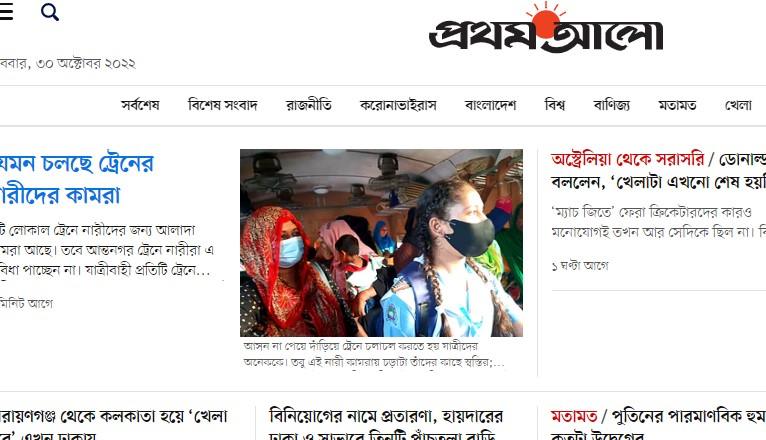

<!--Markdown Tuitorial-->
Tariqul Islam  
This is second line


</br>


<hr/>
For horizontal Tool
___


</br>


### Heading 

# Heading 1
## Heading 2
### Heading 3

#### Heading 4
##### Heading 5

###### Heading 6


</br>


### Paragraph

This Is Paragraph
<P> 
This is Tariqul Islam (sumon). I am 22 years Old. Recently complete Honours 2nd year.
</P>

</br>

### For Italic  
  <i> Italic</i>  
  _Italic_

  
</br>


 ### For Bold/Strong   
  __Bold__
Strick Through  

<del> Delete  </del>  

~~Detele~~

Inline code 

<br/>

### Signle Line code
 `This is  Inline`

 `<h1> Bangladesh</h1>`
###  Multiple Line code
 ```
Amar Sonar Bangla Ami Tomay Valobashi


 ```

  ```html
<html>
<head>  </head>

<body> </body>


</html>


 ```

  ```javascript
console.log('hellow')


 ```


 ```css
head{
    background-color: red
}


 ```

 Create List  
 ### Order list

 <ol> 
 <li>  item1 </li>
 <li>  item2 </li>
 <li>  item3 </li>
 <li>  item4 </li>
 <li>  item5 </li>
 
 </ol>    


 For markdown  


1. item1
2. item2 
    1. item1.1
    2. item1.2
3. item3

</br>

### Unorder List
- item1
- item2
    - item2.1
    - item2.2
- item3


</br>

### Task List

- [x] Taxk1
- [x] Taxk2
- [x] Taxk3
- [] Taxk4

</br>

### Automatic Link

https://www.prothomalo.com/

</br>

###  Disable Automatic Link

`https://www.prothomalo.com/`  

</br>

### Markdown Link sytax

[title](Link)  
[Study with me] [websitelink]

[Facebook](facebooklinl)  
[Study with me] (https://www.google.com)


</br>

### Image Add

![alt text] (Screenshot_1.jpg)  





😈


</br>

### Table


<!--All link is here-->

[Websitelink]:  https://www.google.com

[facebooklink]:  https://www.google.com


